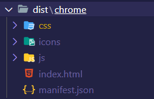
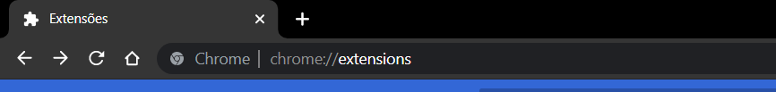
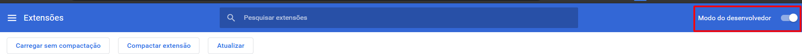
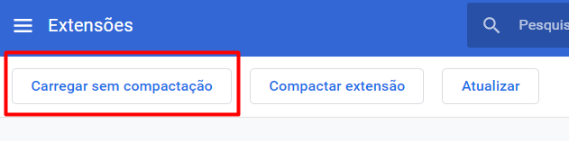
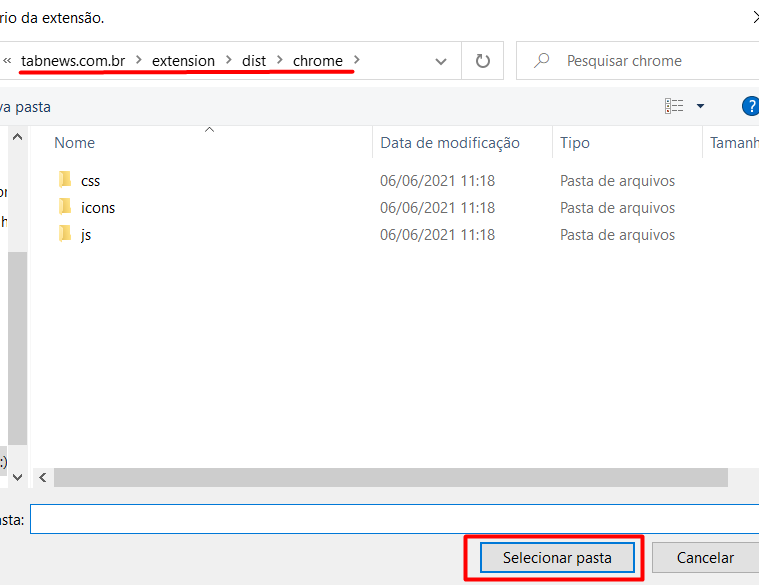
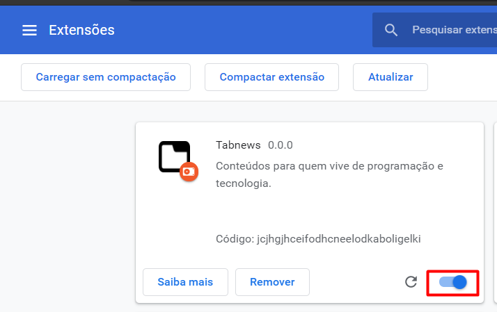
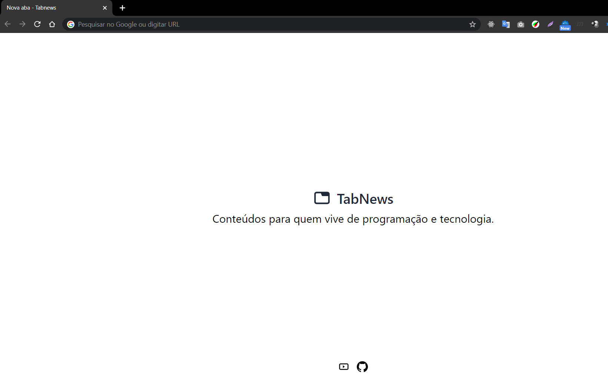

## 💡 Sobre
Esse repositório contempla a execução do tabnews como extensão de navegadores. Atualmente é carregado uma página estática até a disponilização das API's.

## 🛠️ Como executar

Entre no diretório `extesion` e execute os comandos abaixo:

```bash
$ npm install
$ npm run dev:chrome // para executável no chrome ou
$ npm run dev:firefox // para executável no firefox ou
$ npm run dev:opera // para executável no opera
```
Ao finalizar a execução, será criado uma pasta `dist` com os arquivos necessário para instalar a extensão



Agora, basta carregar essa pasta nas extensões do navegador.

Ex: Chrome

* Acessar `chrome://extensions/` nas buscas do browser;



* Habilitar modo de desenvolvedor;



* Clique em "Carregar sem compactação";



* Selecione o diretório `dist` e clique em "Selecionar Pasta";



* Habilite a extensão;



* Abra uma nova aba e verá a extensão carregada.

